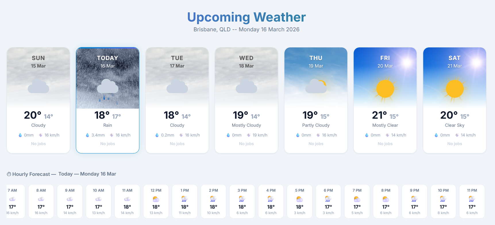

# Weather Schedule Dashboard

A PHP dashboard that combines a 7-day weather forecast with job scheduling and a full Google Calendar integration. Built for field service businesses (eg. mowing businesses) where weather directly affects daily operations.



## Features

- **7-day weather strip** - animated CSS weather icons (sun, cloud, rain, storm, snow, fog) with photo backgrounds, temperature range, wind speed, and precipitation
- **Hourly forecast scroll** - 168-hour breakdown fetched via paginated Google Weather API, scrollable strip highlights the current hour
- **Job cards** - jobs for the selected day pulled from MySQL, each card shows a *weather at job time* badge and highlights rain/storm warnings
- **Google Calendar** - full month view with create, edit, and delete via Google Calendar API (OAuth 2.0 refresh-token flow, no user login required after initial setup)
- Auto-refreshes every 30 minutes

## Stack

- PHP 8.1+, PDO MySQL
- Google Weather API
- Google Calendar API (OAuth 2.0)
- Vanilla JS, CSS animations

## Setup

### 1. Clone and configure

Copy the config block at the top of `upcoming_week.php` and fill in your values, or set the equivalent environment variables:

```
DB_HOST
DB_NAME
DB_USER
DB_PASS
GOOGLE_CLIENT_ID
GOOGLE_CLIENT_SECRET
GOOGLE_API_KEY
GOOGLE_CALENDAR_ID
```

Update the location constants to match your area:

```php
define('WEATHER_LAT',  -27.470125);          
define('WEATHER_LON',  153.021072);
define('WEATHER_CITY', 'Brisbane, QLD');
define('WEATHER_TZ',   'Australia/Brisbane');
```

### 2. Google APIs

Enable the following in Google Cloud Console:
- **Google Weather API** - requires billing
- **Google Calendar API** - create OAuth 2.0 credentials (Desktop app type), run your OAuth flow once, and store the resulting access/refresh tokens in the `google_tokens` table (schema in the file header). Calendar API is completely optional though.

### 3. Database

Adjust the jobs query in the file to match your schema.

### 4. Weather card images

Place images named `sunny.jpg`, `cloudy.jpg`, `partly-cloudy.jpg`, `rain.jpg`, `drizzle.jpg`, `storm.jpg`, `snow.jpg`, and `fog.jpg` in `assets/images/` if you want anything different to what I have.
